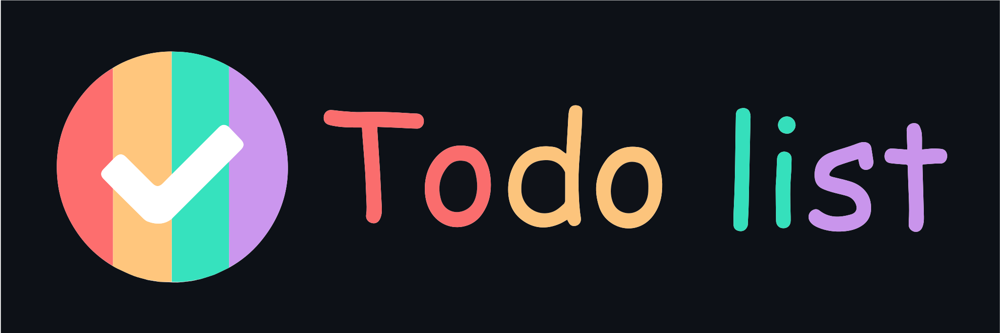

<centre></centre>
A straightforward web application, allowing you to save your daily chores so you won't forget anything.
 

        

 

# About the project.
This project is a TODO list app, with nice animations. It allows the users to create, delete or modify tasks. The user can add planned tasks or delete tasks that are not needed. Also, the app has the ability to indicate if a task is completed or not, which is achieved by differentiated opacity between completed and pending tasks. 

 
 

# Features
- Track you daily tasks
- Add new tasks
- Mark tasks as Completed 
- Delete Completed tasks
- Add voice notes to be appear as tasks
- Lovely animations to enhance user experience

 
 

# Technologies
- HTML
- Javascript
- CSS

 
 

# Check out the application
Find the application runnning at:
https://rick-mad-lab.github.io/Todolist/

 
 

# How to Run the project locally
To run the project locally,

- Clone the project 
- Browse to the project directory on your system.
- Open index.html

You'll find the project running in your browser.. Enjoy!

 
 

# Contributing to this project
We welcome all kinds of positive contributions helping us to improve and grow the project.

If you wish to contribute, you can work on any issues [listed here](https://github.com/Rick-mad-lab/Todolist/issues) or create one on your own. After adding your code, please send us a Pull Request.

> Please read [`CONTRIBUTING`](CONTRIBUTING.md) and [`CODE OF CONDUCT`](CODE_OF_CONDUCT.md) to understand the process for submitting pull requests to us and comply to code of conduct.